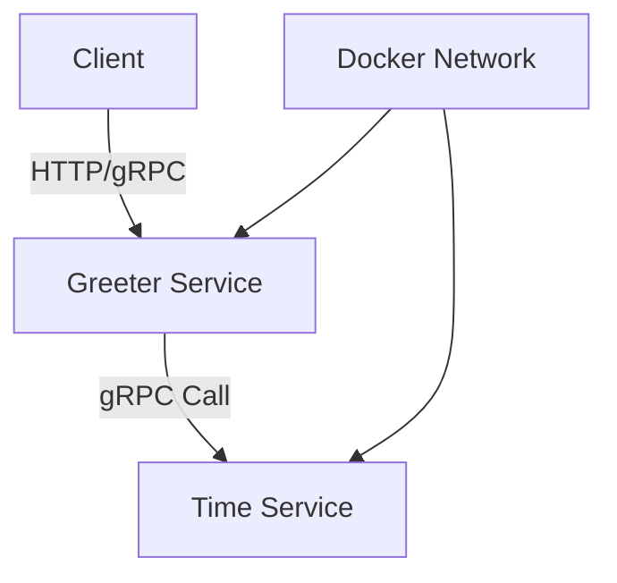
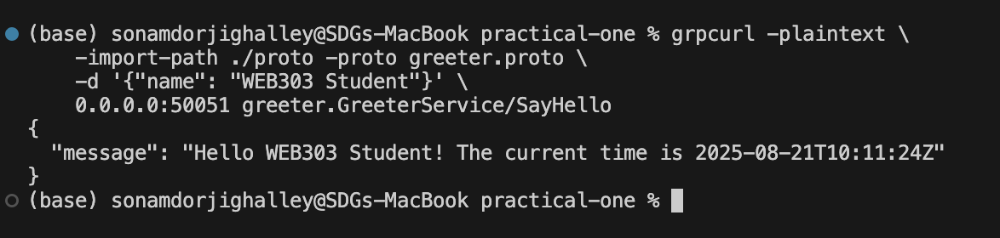

# Multi-Service gRPC Application

A distributed microservice application built with Go and gRPC, consisting of two services that communicate with each other using Protocol Buffers and Docker Compose for orchestration.

## 🏗️ Architecture

This project demonstrates a microservice architecture with the following components:

```
┌─────────────────┐     gRPC     ┌─────────────────┐
│  Greeter Service │ ────────────▶│  Time Service   │
│    (Port 50051) │              │   (Port 50052)  │
└─────────────────┘              └─────────────────┘
        │                                 │
        └─────────────────┬───────────────┘
                          │
                    ┌─────▼─────┐
                    │  Docker   │
                    │  Network  │
                    └───────────┘
```

## 📁 Project Structure

```
practical-one/
├── docker-compose.yml          # Service orchestration
├── go.mod                      # Go module dependencies
├── go.sum                      # Go module checksums
├── README.md                   # Project documentation
│
├── proto/                      # Protocol Buffer definitions
│   ├── greeter.proto          # Greeter service definition
│   ├── time.proto             # Time service definition
│   └── gen/                   # Generated Go code
│       ├── greeter.pb.go      # Generated greeter types
│       ├── greeter_grpc.pb.go # Generated greeter gRPC client/server
│       ├── time.pb.go         # Generated time types
│       └── time_grpc.pb.go    # Generated time gRPC client/server
│
├── time-service/              # Time service implementation
│   ├── Dockerfile            # Container build instructions
│   └── main.go               # Service implementation
│
└── greeter-service/          # Greeter service implementation
    ├── Dockerfile            # Container build instructions
    └── main.go               # Service implementation
```

## 🚀 Services

### Time Service (Port 50052)

**Purpose**: Provides current timestamp functionality

- **Endpoint**: `GetTime(TimeRequest) → TimeResponse`
- **Functionality**: Returns the current time in RFC3339 format
- **Internal service**: Not exposed externally, only accessible to other services

### Greeter Service (Port 50051)

**Purpose**: Provides personalized greeting with timestamp

- **Endpoint**: `SayHello(HelloRequest) → HelloResponse`
- **Functionality**:
  - Accepts a name parameter
  - Calls the Time Service to get current time
  - Returns a personalized greeting with timestamp
- **External service**: Exposed on port 50051 for client access

## 🔧 Technology Stack

- **Language**: Go 1.23.1
- **Framework**: gRPC + Protocol Buffers
- **Containerization**: Docker & Docker Compose
- **Architecture**: Microservices with inter-service communication

## 🛠️ Prerequisites

- Docker and Docker Compose installed
- Go 1.23+ (for local development)
- Protocol Buffer compiler `protoc` (for regenerating proto files)

## 🚀 Quick Start

### Running the Application

1. **Clone and navigate to the project**:

   ```bash
   cd practical-one
   ```

2. **Build and start all services**:

   ```bash
   docker compose up --build
   ```

3. **Verify services are running**:
   ```bash
   docker compose ps
   ```

  Should see both services running:

- `greeter-service` on port 50051
- `time-service` on port 50052 (internal)

### Testing the Services

**Using grpcurl** (if installed):

```bash
# Test the Greeter Service
grpcurl -plaintext -d '{"name":"World"}' localhost:50051 greeter.GreeterService/SayHello
```

**Expected Response**:

```json
{
  "message": "Hello World! The current time is 2025-08-18T10:30:45Z"
}
```

## 🐳 Docker Configuration

### Service Configuration (docker-compose.yml)

```yaml
services:
  time-service:
    build:
      context: .
      dockerfile: time-service/Dockerfile
    hostname: time-service

  greeter-service:
    build:
      context: .
      dockerfile: greeter-service/Dockerfile
    hostname: greeter-service
    ports:
      - "50051:50051"
    depends_on:
      - time-service
```

### Multi-stage Docker Build

Both services use multi-stage builds for optimized production images:

- **Stage 1**: Build the Go binary in a full Go environment
- **Stage 2**: Copy binary to minimal Alpine Linux image

## 📡 API Documentation

### Time Service API

```protobuf
service TimeService {
  rpc GetTime(TimeRequest) returns (TimeResponse);
}

message TimeRequest {}

message TimeResponse {
  string current_time = 1;  // RFC3339 format timestamp
}
```

### Greeter Service API

```protobuf
service GreeterService {
  rpc SayHello(HelloRequest) returns (HelloResponse);
}

message HelloRequest {
  string name = 1;  // Name to greet
}

message HelloResponse {
  string message = 1;  // Personalized greeting with timestamp
}
```

## 🔄 Development Workflow

### Local Development

1. **Install dependencies**:

   ```bash
   go mod tidy
   ```

2. **Run Time Service locally**:

   ```bash
   go run time-service/main.go
   ```

3. **Run Greeter Service locally** (in another terminal):
   ```bash
   go run greeter-service/main.go
   ```

### Regenerating Protocol Buffers

If you modify the `.proto` files:

```bash
# Generate Go code from proto files
protoc --go_out=. --go-grpc_out=. proto/*.proto
```

## 🔍 Troubleshooting

### Common Issues

1. **Build Error: "package not found"**

   - Ensure all proto files are generated correctly
   - Run `go mod tidy` to update dependencies

2. **Connection Refused**

   - Check if services are running: `docker compose ps`
   - Verify network connectivity between containers

3. **Port Already in Use**
   - Stop any existing services on ports 50051/50052
   - Use `docker compose down` to stop all services

### Useful Commands

```bash
# View service logs
docker compose logs greeter-service
docker compose logs time-service

# Restart a specific service
docker compose restart greeter-service

# Stop all services
docker compose down

# Build without cache
docker compose build --no-cache
```

## 🎯 Key Features

- ✅ **Microservice Architecture**: Loosely coupled services
- ✅ **gRPC Communication**: High-performance, type-safe inter-service communication
- ✅ **Docker Compose**: Easy orchestration and deployment
- ✅ **Protocol Buffers**: Efficient serialization and API contracts
- ✅ **Multi-stage Builds**: Optimized Docker images
- ✅ **Service Discovery**: DNS-based service resolution
- ✅ **Error Handling**: Graceful error propagation between services

## 📊 Service Dependencies



## 🏁 Conclusion

This project demonstrates a well-structured microservice application using modern Go development practices. The services are containerized, communicate via gRPC, and can be easily deployed using Docker Compose.

The architecture showcases:

- Inter-service communication patterns
- Protocol Buffer usage for API definitions
- Docker containerization best practices
- Service orchestration with Docker Compose

---

## 🚶‍♀️ My Approach, Steps Taken, and Challenges Encountered

### Approach

My approach to building this microservice-based application focused on:

1. **Service Separation**: Creating two distinct services with clearly defined responsibilities

   - Time Service: A utility service providing time information
   - Greeter Service: A customer-facing service that depends on the Time Service

2. **Contract-First Development**: Using Protocol Buffers to define service contracts before implementation

   - Defined clear message formats and service interfaces
   - Generated Go code from these definitions

3. **Docker-First Deployment**: Designing the application for containerized deployment from the start
   - Used Docker Compose for orchestration
   - Implemented service discovery through Docker networking

### Steps Taken

1. **Service Design and Planning**:

   - Mapped out the overall architecture and communication flow
   - Decided on the protocol (gRPC) and message formats

2. **Protocol Buffer Definition**:

   - Created `time.proto` and `greeter.proto` files
   - Generated Go code using the Protocol Buffer compiler

3. **Service Implementation**:

   - Implemented the Time Service with a simple time function
   - Implemented the Greeter Service with integration to the Time Service
   - Added proper error handling and logging

4. **Containerization**:

   - Created Dockerfiles for each service
   - Set up Docker Compose for orchestration
   - Configured networking between services

5. **Testing**:
   - Used grpcurl to test the services individually and together
   - Verified proper communication between services

### Challenges Encountered

1. **Service Discovery**:

   - Initially struggled with how the Greeter Service would locate the Time Service
   - Resolved by using Docker Compose's automatic DNS resolution where service names become hostnames

2. **Error Handling Across Services**:

   - Needed proper error propagation when the Time Service was unavailable
   - Implemented proper error handling in the Greeter Service to manage downstream failures

3. **Protocol Buffer Generation**:

   - Initial issues with the generated code structure and import paths
   - Resolved by organizing the project structure and using the correct go_package option

4. **Docker Networking**:

   - Ensuring services could communicate correctly inside Docker network
   - Needed to understand how Docker Compose sets up the network and assigns hostnames

5. **Testing gRPC Services**:
   - Learning to use tools like grpcurl for testing gRPC services
   - Setting up proper testing workflows for microservices

These challenges provided valuable learning experiences in microservice architecture, gRPC communication patterns, and Docker-based deployment strategies.

---

## 🔗 How `greeter-service` Finds `time-service` in Docker Network

When using **Docker Compose**, all defined services (`time-service` and `greeter-service`) are automatically placed inside the **same virtual network**.

- Each service is assigned a **hostname** equal to its service name in the `docker-compose.yml` file.
- In this case:
  - `time-service` is reachable at the hostname `time-service` on port `50052`.
  - `greeter-service` is reachable at the hostname `greeter-service` on port `50051`.

Inside the `greeter-service` Go code:

```go
conn, err := grpc.Dial("time-service:50052", grpc.WithTransportCredentials(insecure.NewCredentials()))
```

### Final Output


