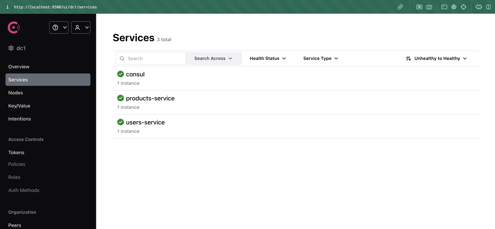
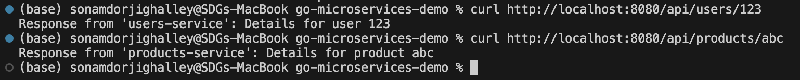
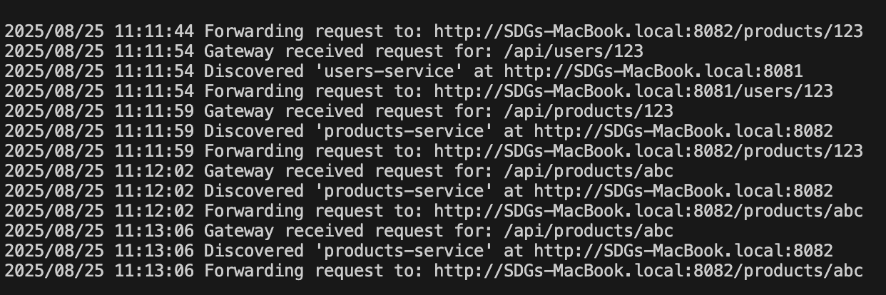

# Go Microservices Demo

This practical describes a basic **microservices architecture** built with Go. It has three main parts:
* An **API Gateway** acts as the main entry point.
* A **Products Service** manages product information.
* A **Users Service** manages user information.

Each part is a separate Go application that talks to the others using HTTP.


## Approach

- **Separation of Concerns:** Each service is responsible for a specific domain (products or users), promoting modularity and maintainability.
- **API Gateway:** Acts as a single entry point, routing requests to the appropriate service.
- **HTTP Communication:** Services communicate via HTTP, making it easy to scale or replace components independently.
- **Go Modules:** Each service and the gateway are managed as separate Go modules for dependency isolation.

## Steps Taken

1. **Project Setup:**

   - Created a root directory with subfolders for the API Gateway and each service.
   - Initialized Go modules in each component.

2. **Service Implementation:**

   - Developed `main.go` for both Products and Users services, exposing RESTful endpoints.
   - Implemented basic CRUD operations for demonstration.

3. **API Gateway:**

   - Built a gateway that forwards incoming requests to the appropriate service based on the URL path.
   - Handled request routing and response aggregation.

4. **Testing:**
   - Used `curl` and Postman to test endpoints via the API Gateway.
   - Verified inter-service communication and error handling.

## Challenges Encountered

- **Service Discovery:** In a real-world scenario, dynamic service discovery would be needed. For this demo, service addresses are hardcoded.
- **Error Handling:** Ensuring consistent error responses across services required careful design.
- **Modularization:** Managing dependencies and module paths for multiple Go modules in a single repo required attention to import paths.
- **Local Testing:** Running multiple services locally required managing different ports and ensuring no conflicts.

## How to Run

1. Start each service in its respective directory:
   ```sh
   cd services/products-service && go run .
   cd services/users-service && go run .
   ```
2. Start the API Gateway:
   ```sh
   cd api-gateway && go run .
   ```
3. Use tools like `curl` or Postman to interact with the API Gateway endpoints.

## Conclusion

This practical demonstrates the fundamentals of building and running microservices in Go, including modularization, inter-service communication, and gateway routing. It provides a foundation for more advanced topics such as service discovery, authentication, and deployment.

## Final output

Consul UI showing both services registered and healthy



terminal cURL making both requests



API-GATEWAY terminal display



[github repo link for the working code](https://github.com/SDGV2734/go_microservice_demo.git)