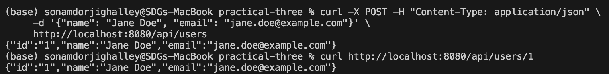
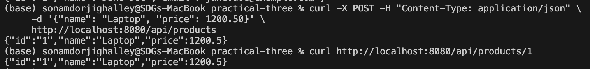
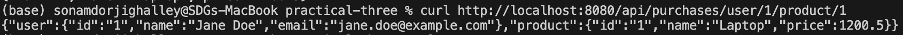
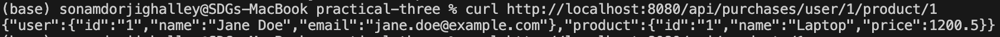

# Practical Three: Full-Stack Microservices with gRPC, Databases, and Service Discovery

## Project Overview

This project demonstrates a microservices architecture using Go, Docker, and Consul for service discovery. It consists of three main components:

- **API Gateway**: Handles HTTP requests and routes them to the appropriate microservices.
- **Products Service**: Manages product-related data and operations.
- **Users Service**: Manages user-related data and operations.

All services are containerized using Docker and orchestrated with Docker Compose. Consul is used for dynamic service discovery, allowing the API Gateway to locate and communicate with the product and user services without hardcoding their addresses.

---

## Problem Statement

Initially, the API Gateway was directly calling the user and product services using hardcoded ports. This approach is not scalable and does not leverage service discovery. Additionally, the composite endpoint (which aggregates data from both user and product services) was not implemented correctly, and the services were not communicating with each other as intended.

---

## Solution & Fixes

### 1. Consul Service Discovery Integration

- The API Gateway was refactored to use Consul for discovering the addresses of the user and product services dynamically.
- Instead of hardcoding service addresses, the gateway queries Consul to find healthy instances of each service.

### 2. Composite Endpoint Fix

- The composite endpoint in the API Gateway was fixed to properly aggregate data from both the user and product services.
- The gateway now makes requests to both services (using addresses discovered via Consul), combines the responses, and returns the aggregated result to the client.

### 3. Service Communication

- The services are now able to communicate with each other through the API Gateway, with service addresses resolved at runtime via Consul.

---

## Architecture

```
+-------------------+         +-------------------+
|                   |         |                   |
|   Users Service   |<------->| Products Service  |
|                   |         |                   |
+---------^---------+         +---------^---------+
          |                             |
          |                             |
          v                             v
+------------------------------------------------+
|                Consul Service                  |
+------------------------------------------------+
          ^                             ^
          |                             |
+---------+---------+         +---------+---------+
|                   |         |                   |
|    API Gateway    +-------->+   HTTP Client     |
|                   |         |                   |
+-------------------+         +-------------------+
```

- **API Gateway** queries Consul to discover the addresses of the user and product services.
- **Consul** maintains a registry of available services and their health status.
- **Users Service** and **Products Service** register themselves with Consul.

---


2. **Consul UI** is available at [http://localhost:8500](http://localhost:8500)
3. **API Gateway** is available at [http://localhost:8080](http://localhost:8080)

---

## Example HTTP Request

final HTTP request and response here:







---


## Notes

- Ensure Docker and Docker Compose are installed.
- Consul must be running for service discovery to work.
- The API Gateway will not function correctly if services are not registered with Consul.
